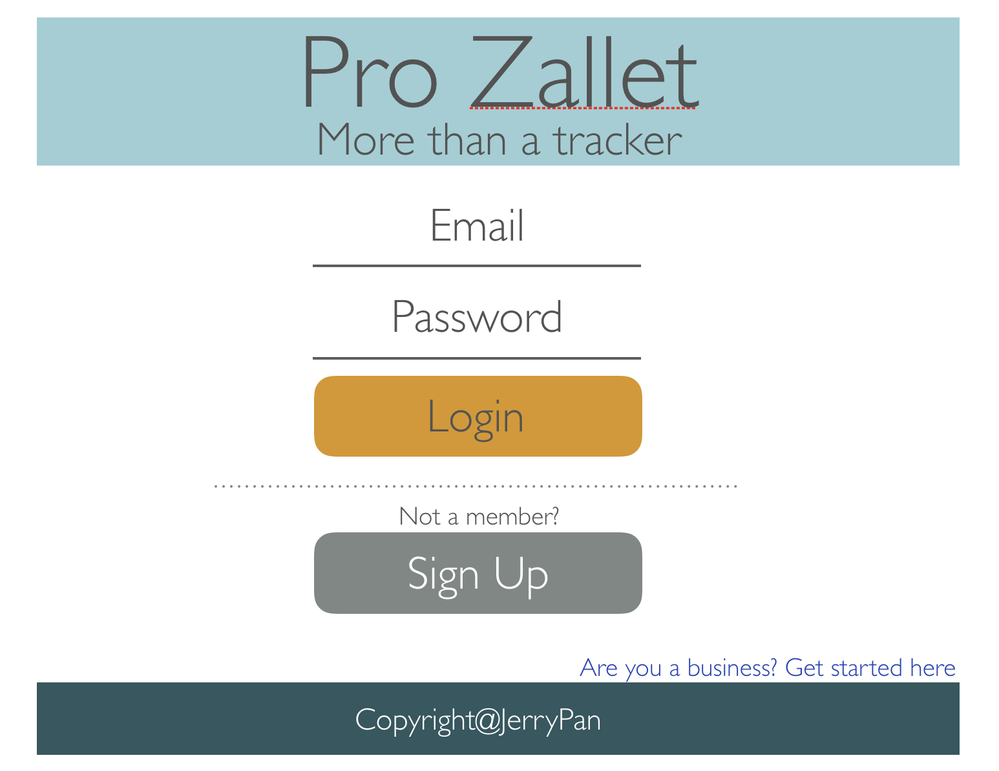
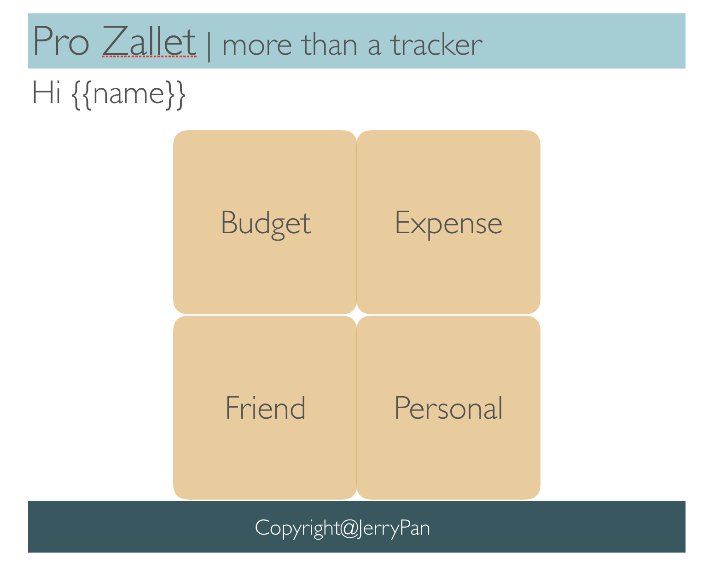
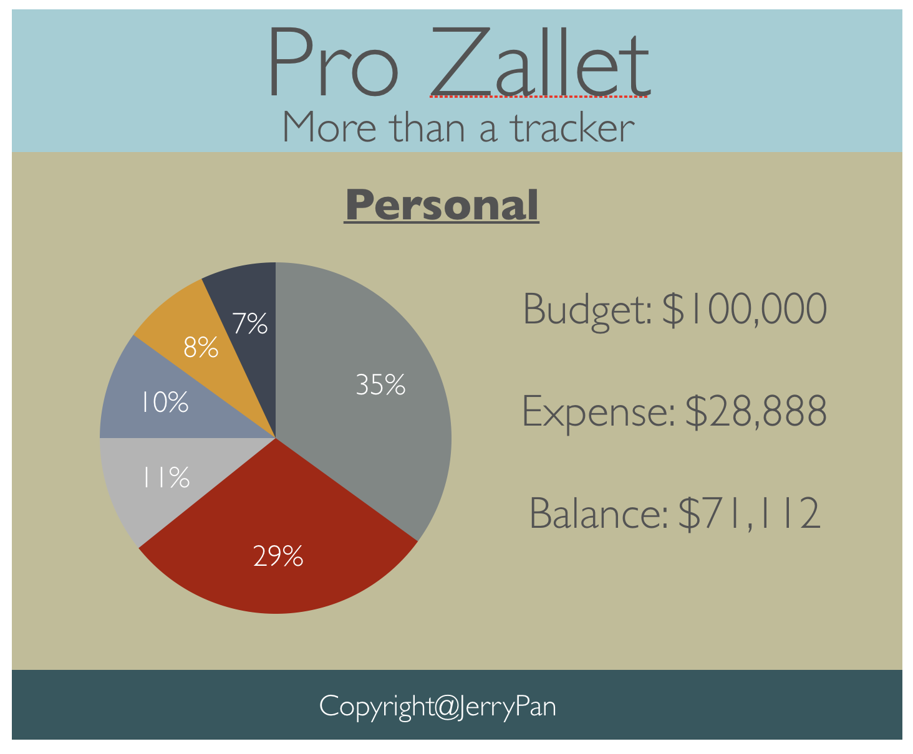
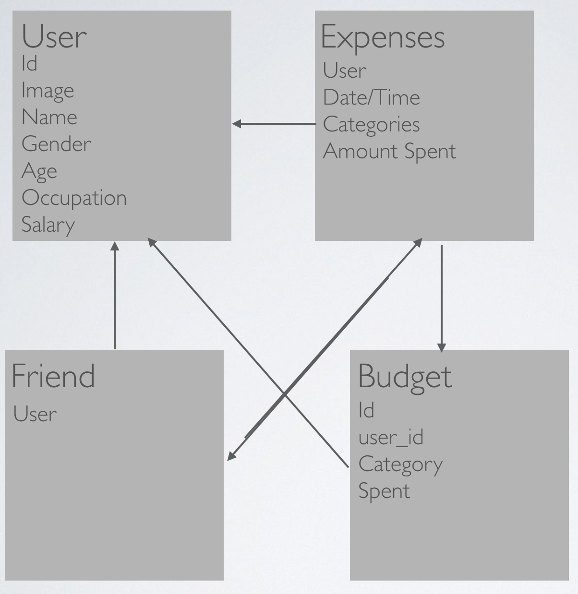

# Introduction
*   Pro Zallet is money expense tracker app meant to help user to monitor their expenses and thus enabling responsible saving behaviour in the long run. Pro is a shorthand for 'professional' and Zallet is a fancy name to replace 'wallet'.

# Heroku Hosting SIte
*   https://gentle-cliffs-18815.herokuapp.com/

# Features
1. Mobile friendly app
2. Simple registration process
3. A budget to monitor reasonable monthly expenses
4. Adding friends function. This will enable tracking of loan amount with tracked record.
5. Group fund feature that will enable one person to key the expenses and all the relevant parties will be able to see it in their account.

# RESTful
* /user/new (create new user)
* /user/login (registered user)
* /user/budget (budget to monitor expense)
* /user/expense (user expense tracker: create, update, delete)

# Wireframe

## Home Page

## User Dashboard

## Budget Page

## Friend List

# ERD

